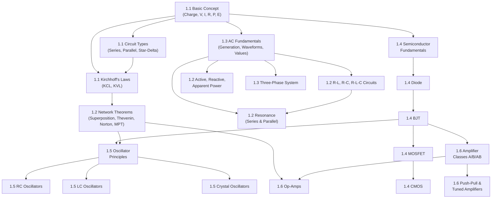

# CHAPTER 1 — MASTER ROADMAP

## Concept of Basic Electrical and Electronics Engineering (AExE01)

---

## 1. Complete Hierarchical Structure

```
Chapter 1: Concept of Basic Electrical and Electronics Engineering
│
├── 1.1 Basic Concept (AExE0101)
│   ├── 1.1.1 Electric Charge (prerequisite)
│   ├── 1.1.2 Electric Voltage (Potential Difference)
│   ├── 1.1.3 Electric Current
│   ├── 1.1.4 Resistance and Ohm's Law
│   ├── 1.1.5 Electric Power
│   ├── 1.1.6 Electric Energy
│   ├── 1.1.7 Conducting and Insulating Materials
│   │   ├── Conductors
│   │   ├── Insulators
│   │   └── Semiconductors (preview for §1.4)
│   ├── 1.1.8 Series Electric Circuits
│   ├── 1.1.9 Parallel Electric Circuits
│   ├── 1.1.10 Star (Y) Connection
│   ├── 1.1.11 Delta (Δ) Connection
│   ├── 1.1.12 Star-Delta Conversion
│   ├── 1.1.13 Delta-Star Conversion
│   ├── 1.1.14 Kirchhoff's Current Law (KCL)
│   ├── 1.1.15 Kirchhoff's Voltage Law (KVL)
│   ├── 1.1.16 Circuit Classifications
│   │   ├── Linear vs Non-linear Circuits
│   │   ├── Bilateral vs Unilateral Circuits
│   │   └── Active vs Passive Circuits
│   └── 1.1.17 Section Summary & Comparison Tables
│
├── 1.2 Network Theorems (AExE0102)
│   ├── 1.2.1 Superposition Theorem
│   ├── 1.2.2 Thevenin's Theorem
│   ├── 1.2.3 Norton's Theorem
│   ├── 1.2.4 Maximum Power Transfer Theorem
│   ├── 1.2.5 R-L Circuits (DC & AC)
│   ├── 1.2.6 R-C Circuits (DC & AC)
│   ├── 1.2.7 R-L-C Circuits (DC & AC)
│   ├── 1.2.8 Resonance in AC Series Circuits
│   ├── 1.2.9 Resonance in AC Parallel Circuits
│   ├── 1.2.10 Active Power (Real Power)
│   ├── 1.2.11 Reactive Power
│   └── 1.2.12 Apparent Power, Power Factor, Power Triangle
│
├── 1.3 Alternating Current Fundamentals (AExE0103)
│   ├── 1.3.1 Principle of AC Generation
│   ├── 1.3.2 Equations of AC Voltage and Current
│   ├── 1.3.3 AC Waveforms
│   ├── 1.3.4 Peak Value
│   ├── 1.3.5 Average Value
│   ├── 1.3.6 RMS Value
│   ├── 1.3.7 Form Factor & Crest Factor (supporting)
│   ├── 1.3.8 Phasor Representation (supporting)
│   └── 1.3.9 Three-Phase System
│       ├── Generation & Phase Displacement
│       ├── Star and Delta Connections
│       ├── Line vs Phase Quantities
│       └── Three-Phase Power
│
├── 1.4 Semiconductor Devices (AExE0104)
│   ├── 1.4.1 Semiconductor Fundamentals (prerequisite)
│   │   ├── Intrinsic Semiconductors
│   │   ├── Extrinsic Semiconductors (N-type, P-type)
│   │   └── PN Junction
│   ├── 1.4.2 Semiconductor Diode
│   │   ├── Construction & Operation
│   │   ├── V-I Characteristics
│   │   ├── Forward & Reverse Bias
│   │   ├── Breakdown
│   │   └── Applications
│   ├── 1.4.3 BJT — Bipolar Junction Transistor
│   │   ├── Construction (NPN, PNP)
│   │   ├── Transistor Action
│   │   ├── Current Relationships (α, β)
│   │   ├── Configurations (CE, CB, CC)
│   │   ├── Operating Regions
│   │   ├── Biasing & Q-Point
│   │   ├── Small-Signal Model (h-parameter, hybrid-π)
│   │   └── Large-Signal Model
│   ├── 1.4.4 MOSFET
│   │   ├── Construction & Working
│   │   ├── Threshold Voltage
│   │   ├── Enhancement & Depletion Modes
│   │   ├── Regions of Operation
│   │   ├── Characteristics
│   │   └── Applications
│   └── 1.4.5 CMOS
│       ├── NMOS & PMOS
│       ├── CMOS Inverter
│       ├── Switching Operation
│       ├── Power Consumption
│       └── Applications
│
├── 1.5 Signal Generator (AExE0105)
│   ├── 1.5.1 Basic Principles of Oscillation
│   │   ├── Positive Feedback
│   │   └── Barkhausen Criterion
│   ├── 1.5.2 RC Oscillators
│   │   ├── Wien Bridge Oscillator
│   │   └── Phase-Shift Oscillator
│   ├── 1.5.3 LC Oscillators
│   │   ├── Hartley Oscillator
│   │   └── Colpitts Oscillator
│   ├── 1.5.4 Crystal Oscillators
│   │   ├── Piezoelectric Effect
│   │   └── Crystal Equivalent Circuit
│   └── 1.5.5 Waveform Generators
│       ├── Square Wave
│       ├── Triangular Wave
│       └── Sawtooth Wave
│
└── 1.6 Amplifiers (AExE0106)
    ├── 1.6.1 Amplifier Fundamentals (supporting)
    │   ├── Signal Amplification
    │   ├── Voltage, Current, Power Gain
    │   └── Decibel Scale
    ├── 1.6.2 Classification of Output Stages
    ├── 1.6.3 Class A Output Stage
    ├── 1.6.4 Class B Output Stage
    ├── 1.6.5 Class AB Output Stage
    ├── 1.6.6 Biasing the Class AB Stage
    ├── 1.6.7 Power BJTs
    ├── 1.6.8 Transformer-Coupled Push-Pull Stages
    ├── 1.6.9 Tuned Amplifiers
    └── 1.6.10 Operational Amplifiers (Op-Amps)
        ├── Ideal vs Practical Op-Amp
        ├── Open-Loop & Closed-Loop Gain
        ├── Virtual Short & Virtual Ground
        ├── Inverting Amplifier
        ├── Non-Inverting Amplifier
        ├── Voltage Follower
        ├── Summing Amplifier
        ├── Difference Amplifier
        ├── Integrator & Differentiator
        └── Comparator
```

---

## 2. Dependency Relationships



> [!NOTE]
> **Key dependency insight**: Section 1.2 spans both DC analysis (network theorems) and AC analysis (R-L-C, resonance, power). AC fundamentals from §1.3 are needed to fully understand parts of §1.2. The recommended approach is to study §1.1 → §1.3 (AC basics only) → §1.2 (full section), or study §1.2 network theorems first (DC), then §1.3, then return for AC parts of §1.2. We will follow the syllabus order but introduce AC concepts as needed.

---

## 3. Recommended Learning Order

| Order | Topic | Rationale |
|-------|-------|-----------|
| 1 | §1.1 — Charge, Voltage, Current, Resistance, Ohm's Law | Foundation for everything |
| 2 | §1.1 — Power, Energy | Builds on V, I, R |
| 3 | §1.1 — Conductors, Insulators | Material classification |
| 4 | §1.1 — Series & Parallel Circuits | First circuit analysis |
| 5 | §1.1 — Star-Delta, Delta-Star Conversion | Circuit transformation |
| 6 | §1.1 — Kirchhoff's Laws (KCL, KVL) | Core analysis tool |
| 7 | §1.1 — Circuit Classifications | Conceptual framework |
| 8 | §1.2 — Superposition Theorem | First network theorem (uses KVL/KCL) |
| 9 | §1.2 — Thevenin's Theorem | Most important theorem |
| 10 | §1.2 — Norton's Theorem | Dual of Thevenin |
| 11 | §1.2 — Maximum Power Transfer | Builds on Thevenin |
| 12 | §1.3 — AC Generation, Equations, Waveforms | AC foundation |
| 13 | §1.3 — Peak, Average, RMS Values | AC measurement |
| 14 | §1.3 — Phasor Representation | AC analysis tool |
| 15 | §1.2 — R-L, R-C, R-L-C Circuits (AC context) | AC circuit analysis |
| 16 | §1.2 — Impedance, Reactance | AC circuit parameters |
| 17 | §1.2 — Series Resonance | AC special case |
| 18 | §1.2 — Parallel Resonance | AC special case |
| 19 | §1.2 — Active, Reactive, Apparent Power | AC power |
| 20 | §1.3 — Three-Phase System | AC power distribution |
| 21 | §1.4 — Semiconductor Fundamentals | Electronics foundation |
| 22 | §1.4 — Diode | First device |
| 23 | §1.4 — BJT | Core transistor |
| 24 | §1.4 — MOSFET | Field-effect transistor |
| 25 | §1.4 — CMOS | Digital electronics bridge |
| 26 | §1.5 — Oscillator Principles | Feedback theory |
| 27 | §1.5 — RC, LC, Crystal Oscillators | Specific circuits |
| 28 | §1.5 — Waveform Generators | Signal shaping |
| 29 | §1.6 — Amplifier Fundamentals | Gain concepts |
| 30 | §1.6 — Class A, B, AB Stages | Output classifications |
| 31 | §1.6 — Push-Pull, Tuned Amplifiers | Power stages |
| 32 | §1.6 — Op-Amps | Integrated amplifiers |

---

## 🏷️ 4. Priority Classification

### 🔴 HIGH PRIORITY — Frequently tested, fundamental, high-value

| Topic | Why High Priority |
|-------|-------------------|
| Ohm's Law | Foundation of all circuit analysis |
| Kirchhoff's Laws (KCL, KVL) | Required for network theorem problems |
| Series & Parallel Circuits | Basic circuit analysis |
| Star-Delta / Delta-Star Conversion | Frequently examined transformation |
| Thevenin's Theorem | Most important network theorem |
| Norton's Theorem | Frequently tested alongside Thevenin |
| Maximum Power Transfer | Classic exam problem |
| RMS, Average, Peak Values | Essential AC calculations |
| R-L-C Circuits | Core AC analysis |
| Series & Parallel Resonance | High-value exam topic |
| Active, Reactive, Apparent Power | Power calculations |
| Three-Phase Power Relationships | Standard exam topic |
| Diode Characteristics | Electronics fundamental |
| BJT Configurations & Biasing | Most tested transistor topic |
| BJT Current Relationships (α, β) | Numerical problems |
| Barkhausen Criterion | Oscillator fundamental |
| Op-Amp Circuits (Inverting, Non-Inverting) | High-frequency exam topic |
| Class A, B, AB Comparison | Conceptual and numerical |

### 🟡 MEDIUM PRIORITY — Important but less frequently the main focus

| Topic | Why Medium Priority |
|-------|---------------------|
| Power and Energy | Often tested indirectly |
| Superposition Theorem | Important but less frequent than Thevenin |
| R-L, R-C Circuits (individually) | Usually tested as part of R-L-C |
| Quality Factor, Bandwidth | Resonance sub-topics |
| Phasor Representation | Tool for AC analysis |
| Small-Signal Model of BJT | Tested in amplifier context |
| MOSFET Regions of Operation | Less frequent than BJT but important |
| CMOS Inverter | Logic bridge topic |
| RC and LC Oscillator Circuits | Frequency calculations |
| Crystal Oscillator | Conceptual understanding |
| Push-Pull Amplifier | Power amplifier topic |
| Tuned Amplifier | Selective amplification |
| Summing & Difference Amplifier | Op-amp applications |

### 🟢 LOW PRIORITY — Still within syllabus, less central to exam

| Topic | Why Low Priority (but still covered) |
|-------|--------------------------------------|
| Electric Charge (as standalone) | Usually implicit in other topics |
| Conducting vs Insulating Materials (detail) | Mostly conceptual/qualitative |
| Linear vs Non-linear Classification | Definition-level testing |
| Bilateral vs Unilateral Classification | Definition-level testing |
| Active vs Passive Classification | Definition-level testing |
| Form Factor, Crest Factor | Rarely tested directly |
| Large-Signal Model of BJT | Less frequent than small-signal |
| Waveform Generators (detail) | Typically conceptual |
| Power BJTs (thermal details) | Specialized sub-topic |
| Integrator, Differentiator (Op-Amp) | Less frequent than basic configs |

> [!IMPORTANT]
> **Low priority ≠ skip.** Every item will be covered. Priority guides study time allocation and revision order.

---

## 5. Topic Characterization

### Numerical-Heavy Topics 🔢
- Ohm's Law calculations
- Series/Parallel resistance, voltage divider, current divider
- Star-Delta / Delta-Star conversion
- Kirchhoff's Laws (mesh & nodal analysis)
- Superposition, Thevenin, Norton numerical procedures
- Maximum Power Transfer calculations
- RMS, Average, Peak value calculations
- Impedance calculations (R-L, R-C, R-L-C)
- Resonant frequency, Q-factor, bandwidth
- Active/Reactive/Apparent power, power factor
- Three-phase voltage, current, power
- Diode circuit calculations
- BJT biasing point (Q-point) calculations
- Transistor parameter calculations (α, β, I_C, I_B, I_E)
- MOSFET drain current calculations
- Oscillator frequency calculations
- Amplifier gain and efficiency calculations
- Op-amp gain calculations

### Formula-Heavy Topics 📐
- Ohm's Law variants
- Power formulas (P = VI, P = I²R, P = V²/R)
- Star-Delta transformation formulas
- AC waveform equations (v = V_m sin(ωt + φ))
- Impedance formulas (Z = R + jX)
- Resonance formulas (f₀, Q, BW)
- Power formulas (P, Q, S, pf)
- Three-phase relationships (V_L = √3 V_ph)
- BJT relationships (I_E = I_C + I_B, β = I_C/I_B)
- MOSFET current equations
- Oscillator frequency formulas
- Op-amp gain formulas

### Diagram-Heavy Topics 🖼️
- Series and parallel circuits
- Star and Delta connections
- Kirchhoff's Laws (circuit loops and nodes)
- Thevenin/Norton equivalent circuits
- AC waveforms (sinusoidal, phasor diagrams)
- R-L, R-C, R-L-C circuit diagrams and phasor diagrams
- Resonance curves (impedance vs frequency)
- Power triangle
- Three-phase connection diagrams and phasor diagrams
- PN junction and depletion region
- Diode V-I characteristics
- BJT construction and circuit configurations (CE, CB, CC)
- BJT characteristic curves
- MOSFET construction and characteristics
- CMOS inverter circuit and transfer characteristic
- Oscillator circuit diagrams (Wien Bridge, Phase-Shift, Hartley, Colpitts, Crystal)
- Amplifier circuit diagrams (Class A, B, AB, Push-Pull)
- Op-amp circuit configurations

### Concept-Heavy Topics 💭
- Conductor vs Insulator vs Semiconductor
- Linear vs Non-linear, Bilateral vs Unilateral, Active vs Passive
- Physical meaning of resonance
- Physical meaning of power factor
- Semiconductor doping (N-type, P-type)
- PN junction operation
- Transistor action (carrier injection & collection)
- CMOS complementary operation
- Positive feedback and oscillation condition
- Amplifier class comparison

### Derivation-Heavy Topics 📝
- Star-Delta / Delta-Star transformation formulas
- Average and RMS values of sinusoidal waveforms
- Three-phase line-phase relationships
- Resonant frequency from impedance condition
- Quality factor derivation
- Maximum power transfer condition
- Thevenin/Norton equivalence
- Oscillator frequency formulas (Wien Bridge, Phase-Shift, Hartley, Colpitts)
- Op-amp gain formulas (from ideal op-amp assumptions)

---

## 6. Commonly Confused Topics ⚡

| Confusion | Why It's Confusing |
|-----------|--------------------|
| **Voltage vs EMF** | Both measured in volts; EMF is source, voltage is across element |
| **Power vs Energy** | P = dE/dt; power is rate, energy is total |
| **Average vs RMS value** | Different integrals; RMS is for power calculations |
| **Resistance vs Reactance vs Impedance** | R is real, X is imaginary, Z is complex |
| **Inductive vs Capacitive reactance sign** | X_L = +ωL, X_C = −1/(ωC) in convention |
| **Series vs Parallel resonance behavior** | Series: min Z, max I; Parallel: max Z, min I |
| **Active vs Reactive power** | P does work, Q oscillates |
| **Line vs Phase quantities (3φ)** | Depends on Star or Delta connection |
| **Star-Delta vs Delta-Star direction** | Formulas are different — not interchangeable |
| **Thevenin vs Norton source deactivation** | Voltage source → short; Current source → open |
| **BJT Cutoff vs Saturation** | Cutoff: both junctions reverse biased; Saturation: both forward |
| **α vs β** | α = I_C/I_E (< 1); β = I_C/I_B (>> 1) |
| **CE vs CB vs CC** | Which terminal is common to input and output |
| **Enhancement vs Depletion MOSFET** | Enhancement: normally OFF; Depletion: normally ON |
| **Positive vs Negative feedback** | Positive → oscillation; Negative → stable amplification |
| **Class A vs B vs AB efficiency** | A: 25% (max), B: 78.5% (max), AB: between |

---

## 7. Expected Difficulty Rating

| Section | Conceptual | Mathematical | Overall | Notes |
|---------|-----------|-------------|---------|-------|
| §1.1 Basic Concept | ⭐⭐ | ⭐⭐ | ⭐⭐ | Foundation — must be rock-solid |
| §1.2 Network Theorems | ⭐⭐⭐ | ⭐⭐⭐⭐ | ⭐⭐⭐⭐ | Procedural and calculation-intensive |
| §1.2 Resonance & Power | ⭐⭐⭐⭐ | ⭐⭐⭐⭐ | ⭐⭐⭐⭐ | Requires AC concepts from §1.3 |
| §1.3 AC Fundamentals | ⭐⭐⭐ | ⭐⭐⭐ | ⭐⭐⭐ | Integration for RMS/Average values |
| §1.3 Three-Phase | ⭐⭐⭐ | ⭐⭐⭐ | ⭐⭐⭐ | Conceptually rich, formula-based calculations |
| §1.4 Diode | ⭐⭐ | ⭐⭐ | ⭐⭐ | Relatively straightforward |
| §1.4 BJT | ⭐⭐⭐⭐ | ⭐⭐⭐⭐ | ⭐⭐⭐⭐ | Multiple configurations, biasing, models |
| §1.4 MOSFET & CMOS | ⭐⭐⭐ | ⭐⭐⭐ | ⭐⭐⭐ | Conceptual understanding critical |
| §1.5 Oscillators | ⭐⭐⭐ | ⭐⭐⭐ | ⭐⭐⭐ | Feedback + frequency derivations |
| §1.6 Amplifier Classes | ⭐⭐⭐ | ⭐⭐⭐ | ⭐⭐⭐ | Efficiency calculations, comparisons |
| §1.6 Op-Amps | ⭐⭐⭐ | ⭐⭐⭐ | ⭐⭐⭐ | Multiple configurations to master |

*(⭐ = Easy, ⭐⭐⭐⭐⭐ = Very Difficult)*

---

## 8. Recommended Revision Order (After Full Study)

| Priority | Revise First | Reason |
|----------|-------------|--------|
| 1st | Thevenin & Norton Theorems | Most exam-critical theorem |
| 2nd | Kirchhoff's Laws + Ohm's Law | Foundation for all problems |
| 3rd | Resonance (Series & Parallel) | High-value, formula-rich |
| 4th | BJT Configurations & Biasing | Most tested electronics topic |
| 5th | Op-Amp Circuits | Frequently tested, formula-based |
| 6th | Three-Phase System | Standard power engineering questions |
| 7th | Active/Reactive/Apparent Power | Power triangle mastery |
| 8th | RMS, Average, Peak Values | AC value calculations |
| 9th | Star-Delta Conversion | Transformation formulas |
| 10th | Amplifier Classes (A, B, AB) | Comparison and efficiency |
| 11th | Maximum Power Transfer | Builds on Thevenin |
| 12th | Superposition Theorem | Multi-source problems |
| 13th | Oscillator Circuits & Frequencies | Frequency formulas |
| 14th | Diode Characteristics | Forward/Reverse bias |
| 15th | MOSFET & CMOS | Working principle |
| 16th | R-L, R-C, R-L-C Circuits | Impedance calculations |
| 17th | Circuit Classifications | Quick recall |
| 18th | Waveform Generators | Conceptual |
| 19th | Comparison Tables | Final review |

---

## 9. Cross-Connection Map

The chapter forms a connected knowledge graph:

| Foundation | Enables |
|-----------|---------|
| Ohm's Law + KVL/KCL | → Network Theorems → Thevenin/Norton |
| Thevenin's Theorem | → Maximum Power Transfer |
| AC Waveform Equations | → RMS/Average Values → Impedance → Resonance → Power |
| Semiconductor Physics | → Diode → BJT → MOSFET → CMOS |
| BJT + Feedback Theory | → Oscillators |
| BJT + Biasing | → Amplifier Classes |
| Network Theorems + Feedback | → Op-Amp Analysis |

---

> [!TIP]
> **Study Strategy**: Master §1.1 completely before moving forward. The entire chapter builds on these fundamentals. If KVL/KCL and series/parallel analysis are shaky, every subsequent topic will be harder than it needs to be.

---

## Ready to Begin

Upon your approval, I will begin with:

**§1.1 Basic Concept — Part 1**: Electric Charge → Voltage → Current → Resistance → Ohm's Law → Power → Energy

This will be a comprehensive, textbook-quality treatment with definitions, derivations, diagrams, worked examples, and numerical problems.
